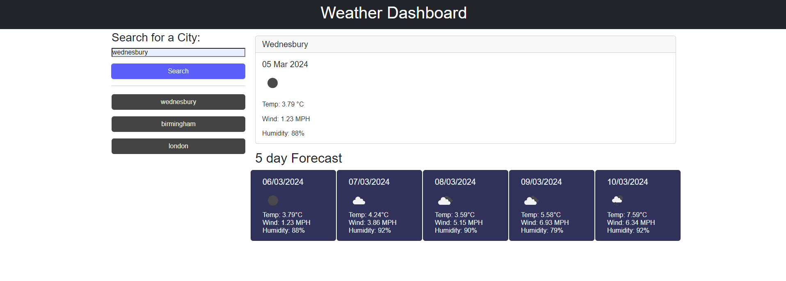

# Weather-Dashboard

## Project Description

The following project uses the [5 Day Weather Forecast](https://openweathermap.org/forecast5) API to retrieve weather data for cities and build a weather dashboard that will run in the browser and feature dynamically updated HTML and CSS.

### Home Page

### Completed Tasks:

* Created a weather dashboard with form inputs.
  * When a user searches for a city they are presented with current and future conditions for that city and that city is added to the search history
  * When a user views the current weather conditions for that city they are presented with:
    * The city name
    * The date
    * An icon representation of weather conditions
    * The temperature
    * The humidity
    * The wind speed
  * When a user view future weather conditions for that city they are presented with a 5-day forecast that displays:
    * The date
    * An icon representation of weather conditions
    * The temperature
    * The humidity
  * When a user click on a city in the search history they are again presented with current and future conditions for that city

## Installation

This single static website can be deployed either locally or to a webserver. With the included "index.html" file containing the main code for the website, and the accompanying "style.css" stylesheet and "script.js" script file. Alternatively, the website can be found on the GitHub Pages link below.

### Notes

Designed primarily for a desktop experience, the site can be accessed on small screen sizes, with a minimum screensize of 600px horizontally. Please keep this in mind when accessing the site on your device.

### GitHub Pages:

[GitHub Pages](https://sunielmudhar.github.io/planner-app/)